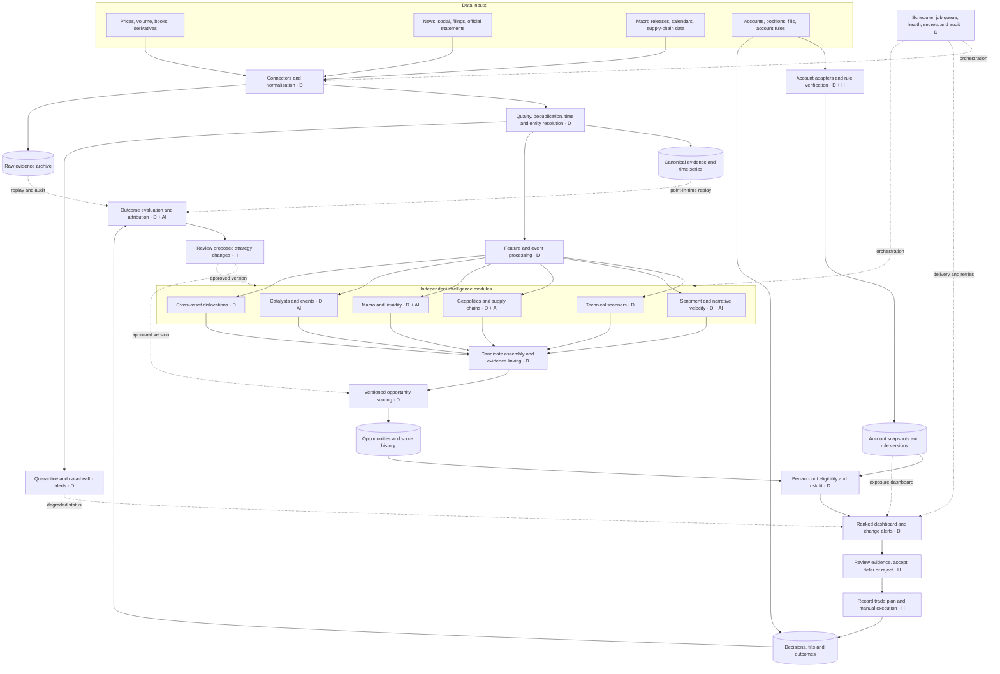

# Trading Automations — master system architecture

Version 0.1 · Architecture foundation · 2026-09-07 (America/Vancouver)

## 1. Purpose and assumptions

Produce a manageable queue of explainable opportunities for Breakoutprop and other portfolios. Every candidate should answer: what changed, what evidence supports it, what contradicts it, what would invalidate it, how long it remains relevant, and which accounts can consider it.

Initial assumptions: a single owner, research and decision support, mixed intraday and longer horizons, and manual trading. Asset universes, providers, account rules, budget, and operational latency are unresolved configuration choices. This document proposes architecture; it does not report deployed capabilities or validated trading performance.

The intelligence system can observe account state and propose trade plans. The human owns trade selection and order submission. An optional execution adapter is a future extension requiring its own scope and validation.

## 2. Master system map

Solid arrows show the main evidence and decision path. Dotted arrows show supporting state, governance, and feedback. D = deterministic code; AI = evidence-bound language analysis; H = human.

## 3. Intelligence modules

Each module is optional and independently versioned. Modules emit observations with evidence and uncertainty, not orders. Each output uses an instrument or entity, horizon, observation time, expiry, provenance, and module version.

| Module | Inputs | Deterministic responsibilities | Useful AI work | Outputs |
| --- | --- | --- | --- | --- |
| Technical analysis | Venue-specific OHLCV, spreads, depth; optional open interest, funding and liquidations | Closed-bar indicators, trend, relative strength, compression, breakouts, volume anomalies, liquidity filters | Explain a computed setup; summarize conflicting timeframes | Setup signal, feature values, trigger and invalidation conditions |
| Sentiment and narrative velocity | Licensed news/social feeds, source metadata, entity aliases | Deduplicate syndicated content, source counts, mention-rate changes, baseline normalization, concentration and spam indicators | Entity-aware stance, theme clustering, novelty and narrative summaries | Narrative cluster, velocity, breadth, stance, source diversity and cited claims |
| Geopolitics and supply chains | Official announcements, trade and shipping data, commodity exposures, company disclosures | Maintain exposure graph; join entities and dated relationships; aggregate verified disruptions | Extract event → transmission channel → exposed assets; generate alternate scenarios and counterevidence | Cited scenario with affected entities, expected horizon, uncertainty and monitored conditions |
| Macro and liquidity | Releases and vintages, policy calendars, rates, yield curves, FX, credit and liquidity proxies | Release surprises against timestamped consensus, changes, spreads, regime features and publication lags | Explain policy language and conflicting macro signals | Dated regime context, liquidity features and scenario annotations |
| Catalysts and events | Economic releases, earnings, unlocks, governance, listings, policy and company calendars | Normalize time zones, reconcile schedule updates, determine event windows, expire or cancel events | Extract event details and distinguish announced facts from speculative dates | Event record, timing confidence, related instruments, pre/post-event watch conditions |
| Cross-asset dislocations | Synchronized prices, rates, basis, funding, commodity/sector benchmarks | Rolling residuals, spread distributions, correlation stability, execution-cost estimates, asynchronous-market filters | Explain plausible drivers with sources | Residual or spread signal, relationship validity, decay horizon and cost assumptions |
| Opportunity assembly and ranking | Module observations, evidence clusters, playbook configuration | Group by thesis/instrument/direction/horizon, avoid duplicate evidence, apply score versions and decay | Draft thesis and strongest opposing interpretation | Explainable opportunity and score breakdown |
| Account and portfolio fit | Rules, equity, positions, pending orders, permissions, costs and instruments | Eligibility gates, headroom, concentration, aggregate exposure, conservative proposed sizing | Explain rejection reasons in plain language | Eligible, blocked or unknown; reasons; optional size proposal |
| Outcome and feedback | All candidate snapshots, decisions, actual fills, subsequent market paths | Net results, excursions, signal cohorts, calibration, walk-forward comparisons | Classify decision notes and recurring failure themes | Evaluation reports and proposed changes awaiting review |

The supply-chain exposure graph can initially be relational edge records. A separate graph database is unnecessary until traversal complexity or scale justifies one. An exposure edge is a sourced relationship; an AI-generated causal hypothesis is stored separately.

## 4. Data acquisition and shared foundations

Use provider adapters behind a common interface. The first implementation should connect only the sources needed by the first playbook. Provider selection requires checking instrument coverage, timeliness, history, revision handling, usage rights, cost and access. Named categories above are requirements, not claims that free or available feeds exist.

Every connector declares its authentication method, rate limits, polling or streaming mode, cursor, expected delay, heartbeat and recovery behavior. Preserve permitted raw payloads with content hashes and retrieval metadata; where storage rights prohibit full retention, retain permitted identifiers, metadata and references.

Canonical identity distinguishes underlying asset, tradable instrument, venue, quote currency and contract. Company, token, country and commodity aliases map to stable IDs. Never silently equate a spot symbol with a perpetual, a company with its ticker, or prices from different venues.

Store source event time, publication time, first observation time and ingestion time separately in UTC. Display the user's time zone in dashboards. Bar intervals specify closure and market calendar. Economic records preserve revisions and original vintages. Backtests select only records available at the simulated decision time, including the historically available universe.

Quality checks detect missing bars, stale snapshots, outliers, duplicate stories, currency/unit conflicts and inconsistent clocks. Suspect records enter quarantine. Dependent outputs become degraded or unknown and cannot silently reuse stale confidence. Corrections invalidate affected scores and create a new version; old evidence remains auditable.

## 5. Storage and application boundaries

Proposed starting deployment: one modular application with separate background worker processes, PostgreSQL for operational records, and a file/object archive for raw payloads and large historical datasets. This is a design choice, subject to the user's hosting and provider preferences. Keep module boundaries in code before splitting into network services.

| Logical store | Main contents | Readers and writers |
| --- | --- | --- |
| Raw archive | Permitted payloads, source metadata, checksums | Connectors write; replay and audit read |
| Canonical market/evidence store | Instruments, bars, observations, source documents, claims, narrative clusters, macro vintages, events, exposure edges | Normalizers write; modules read |
| Derived intelligence | Feature snapshots, module runs, signals, opportunity versions, score components, evidence links | Modules and scoring write; UI and evaluation read |
| Accounts | Rule versions, account snapshots, positions, pending orders, exposure and eligibility snapshots | Account adapters and policy review write; account engine reads |
| Decisions and outcomes | Review actions, plans, order/fill imports, costs, journal entries, outcome labels | Human interface and importers write; evaluation reads |
| Operations and governance | Job runs, source health, delivery outbox, audit events, strategy/config/model versions | Services write; operator dashboard and audit read |

Use database references across these logical stores; they need not be separate database products. Archive large market history in partitioned columnar files as volume grows. Define retention per source license, recovery needs and evaluation horizon. Back up the operational database and versioned archive; periodically verify restoration.

The application API exposes instrument lookup, opportunities, evidence, account fit, review actions, journal imports and health. UI clients read computed snapshots rather than independently recalculating scores. Every write includes an actor or job ID and version checks. Secrets remain outside records and prompts. Logging excludes credentials and minimizes account details.

## 6. Opportunity scoring

Use three separate outputs: opportunity merit, evidence confidence, and account eligibility/fit. A score is a ranking heuristic, not a probability of profit. Compare candidates within compatible playbooks and horizons; do not mix an intraday breakout with a multi-month macro thesis on an uncalibrated global leaderboard.

Each playbook defines required features, optional context, scoring transformations, component weights, penalties and expiry. A technical setup can qualify without a news catalyst if its playbook does not require one. A catalyst playbook cannot treat an absent catalyst as a neutral observation.

An initial research formula is:

`merit = clamp(sum(weight × component_score) − configured_penalties, 0, 100)`

Component scores lie in [0,100] and weights sum to 1 for the playbook's predefined applicable components. Suggested dimensions are setup quality, catalyst strength, narrative acceleration, regime alignment, dislocation magnitude and implementation costs/liquidity. Values and weights must be selected and tested per playbook; no initial weights are claimed to predict returns.

Missing required inputs produce an unscored candidate. Missing optional inputs produce an explicit incomplete score or an approved fallback profile; never silently redistribute their weights. Unavailable and neutral are different states. Expiry is horizon-specific; expired signals cannot promote an opportunity.

Confidence is reported separately from merit using freshness, source reliability, independent corroboration, completeness and measured extraction quality. Model self-confidence alone is insufficient. Several articles repeating the same announcement form one evidence family. Correlated price-derived features are grouped or capped to prevent multiple versions of the same signal from dominating.

Every ranked card shows component contributions, missing inputs, deductions, evidence links, strongest counterargument, last recalculation time, expiry, strategy version and account gate result. Global discovery can group by playbook; account queues rank eligible candidates within those groups. Blocked and unknown candidates remain inspectable outside the actionable queue.

## 7. Account rules and portfolio constraints

Each account profile records provider, product, evaluation/funded stage if applicable, base currency, instruments, contract specifications, leverage/margin permissions, equity, balance, current positions, pending orders, rule version and verification date. Personal portfolios can also express mandate, horizon, cash needs, shorting permissions and concentration limits.

For Breakout, retrieve the user's actual product and displayed limits during onboarding and reconcile the policy calculation against account state. Published rules describe daily-loss and maximum-drawdown equity limits; the account profile must specify exact thresholds, reset conventions and applicable mechanics. Reference: [Breakout program rules](https://www.breakoutprop.com/program-rules/) and [viewing account limits](https://intercom.help/breakoutprop/en/articles/11647187-how-can-i-view-the-maximum-daily-loss-and-maximum-drawdown-limits), checked 2026-09-07 local date. Do not turn a generic published percentage into a confirmed user account configuration.

Eligibility evaluation proceeds in order: verified rules and fresh account state → instrument permissions → data quality → remaining account headroom → existing and pending exposure → proposed trade scenarios → account suitability. Use explicit reason codes for every block or unknown state. Human preference can reject an eligible trade; it does not rewrite the account rules.

Where rules express lower equity floors, calculate current headroom as current marked equity minus each applicable floor. Use the narrower relevant headroom, subtract a configured operational buffer, and assess incremental loss from current marks under the proposed scenario. Do not subtract already-realized or already-marked losses twice. Reset timing, fees, funding, gaps and concurrent pending plans must be represented. Shared limits require aggregate evaluation across linked accounts.

A size proposal needs a human-reviewable entry, invalidation/stop assumption, contract multiplier, currency conversion, cost/slippage allowance and portfolio stress estimate. Unsupported contract types or stale account data return unknown, not a size. Stop prices do not guarantee maximum loss; scenario loss and account headroom are different quantities. Recheck fit when the user records a decision because prices and exposure may have changed.

### Risk management policy and operating level

The first build includes a versioned, owner-approved risk policy for each account. Provider rules and the owner's risk limits are evaluated together; every applicable constraint must pass. Playbooks may add tighter restrictions. A high opportunity score cannot override a risk block or increase an approved risk budget.

Each policy defines the following controls with explicit units, calculation bases and effective dates. Actual thresholds remain unset until selected for the first account; the system supplies no assumed risk percentages.

| Control | Required definition |
| --- | --- |
| Per-trade risk | Maximum planned loss, its currency or percentage basis, and included fees, funding and slippage assumptions |
| Total committed risk | Aggregate scenario-loss budget across open positions, pending orders and reserved plans; reconcile plan/order/fill identity to avoid double counting |
| Concentration | Exposure caps by instrument and configured group of related assets; explicit grouping and stress assumptions |
| Loss and drawdown limits | Owner's daily loss and drawdown limits, measurement basis, realized/unrealized treatment, reset timezone and any high-water-mark convention |
| Account buffer | Headroom reserved below provider limits and how incremental portfolio scenarios consume the remaining budget |
| Position constraints | Maximum concurrent positions, notional/leverage limits and applicable liquidity requirements |
| Reduction and pause rules | Conditions for reducing new-trade risk or pausing new exposure, reduced budgets, cooldowns and explicit resume conditions |

The account's operating risk level is `normal`, `reduced`, `paused` or `unknown`. These labels describe the policy's current operating state, not a prediction that a trade is safe. State is calculated from approved rules and recorded inputs. Missing required policy or account information yields `unknown`; a known pause condition still blocks new exposure even if another check is unknown. Returning to a less restrictive state requires the configured recovery conditions and a recorded owner resume approval. AI cannot change thresholds or resume the account.

Assess risk in two steps. Preliminary screening checks account permissions, policy state and available headroom before a trade plan exists. Final plan assessment requires an exact plan version with entry, stop/invalidation, quantity, costs and scenario assumptions; it checks that plan against current account state, reserved exposure and all applicable limits. Preliminary eligibility must be labeled as screening only. Reassess after any relevant plan, price, account or policy change and before marking a plan ready for manual execution. Plan readiness and risk reservations must be recorded atomically so concurrent plans cannot reuse the same budget.

The dashboard shows the active policy/version, operating level and reasons, configured limits, used and remaining budgets, assessment time and whether a result is preliminary or final. Paused accounts retain monitoring, journaling and review of existing positions. The application blocks new-exposure plan readiness when risk is blocked or unknown; it does not submit, cancel or close venue orders.

## 8. Automations and alerts

These are proposed jobs, not active schedules. Cadences below are initial operating assumptions to validate against strategy horizon, provider limits and budget.

| Job | Proposed trigger | Output and behavior |
| --- | --- | --- |
| Market ingestion and scans | On completed configured bars; streaming only where needed | Normalize data, refresh features, emit deduplicated setup observations |
| News and narrative update | New document or a 5–15 minute polling budget | Extract claims, update clusters and velocity, rescore affected candidates |
| Calendar and macro refresh | Daily reconciliation plus release/event windows | Preserve revisions and changed dates; invalidate outdated event context |
| Account refresh | On imported activity plus provider-supported polling | Refresh equity/exposure and invalidate obsolete eligibility |
| Candidate recomputation | Relevant signal, source correction, expiry or account change | Create versioned opportunity/fit snapshots; only notify meaningful changes |
| Research digest | User-selected daily review time | Summarize eligible candidates, upcoming events, portfolio exposures and data gaps |
| Outcome reconciliation | After fill imports and at horizon completion | Reconcile costs, compute metrics and flag incomplete records |
| Evaluation review | Weekly or after a defined sample cohort matures | Compare playbooks and propose changes for human review |
| Health checks | Per-feed freshness budget and job heartbeat | Show degradation, retries, missing coverage and recovery |

Use idempotent jobs keyed by source cursor, instrument/time window and processing version. Retry transient errors with bounded backoff; send persistent failures to an operator queue. Replays must not resend old alerts. Persist alert intentions in a delivery outbox, track delivery acknowledgements, and reconcile uncertain sends without uncontrolled repetition.

Alert categories: newly qualifying opportunity; material thesis/score change; approaching or rescheduled catalyst; invalidation/expiry; account constraint change; and operational degradation. Each alert contains a concise reason, affected instrument/account, time and expiry, and a link to evidence. Configure channels and quiet hours later. Apply evidence-cluster deduplication, cooldowns, hysteresis around thresholds and per-channel rate limits. Account notifications are observational; the system does not claim to enforce rules at the trading venue.

## 9. Dashboards and human decision points

| View | What the user sees and decides |
| --- | --- |
| Opportunity queue | Candidates grouped by playbook/horizon, merit, confidence, freshness, account fit; select what deserves attention |
| Opportunity detail | Thesis, chart features, cited evidence, counterevidence, catalyst timeline, invalidation, score history; accept, defer or reject with a reason |
| Account cockpit | Equity timestamp, risk policy and operating level, used/remaining risk budgets, available headroom, open/pending/reserved exposure, concentration, blocked candidates and rule verification; assess suitability |
| Macro/narrative context | Regime observations, narrative velocity, source breadth, exposure relationships and alternate scenarios; adjust research focus |
| Event calendar | Confirmed/provisional times, changes, related positions and watch conditions; prepare event review |
| Journal and evaluation | Plans versus actual fills, net outcomes, excursions, rejected candidates and cohort results; review process quality |
| Operations | Feed coverage, lag, failed jobs, AI spend, extraction errors, alert status and version history; repair system gaps |

Human checkpoints are rule/profile verification, thesis review, trade-plan acceptance, manual execution, outcome annotation and approval of material strategy/configuration changes. Record acceptance and execution separately: an accepted idea may never fill.

## 10. AI agent boundaries

Use bounded task workers: a document extractor, narrative analyst, geopolitical scenario analyst, macro interpreter, opportunity brief writer and journal reviewer. They share evidence IDs and structured contracts; a free-running conversation between agents is unnecessary for the initial design.

AI receives the minimum relevant evidence, can retrieve approved read-only sources, and emits schema-validated claims or drafts with citations. Distinguish source facts, inferences, scenarios and unresolved conflicts. Treat ingested text as data, including any instructions embedded in articles or posts. Reject unsupported citations and invalid schemas; mark missing AI enrichment without blocking a playbook that does not require it.

Deterministic code owns arithmetic, timestamps, indicators, velocity metrics, deduplication mechanics, policy checks, score calculation, ranking, scheduling and journal metrics. Human review resolves uncertain entity matches, disputed sources and strategic changes. AI cannot modify risk limits, fabricate missing market values, deploy its own revised strategy or submit orders.

Version prompts, model identifiers, extraction schemas and retrieval inputs. Cache work by evidence hash and version; cap run duration, calls and spend. Evaluate extraction accuracy against labeled examples before enabling it as a required signal. Financial or causal conclusions from prose remain hypotheses until tested against observable conditions.

## 11. Outcomes and learning

Keep all generated candidates and their decision-time snapshots, including rejected, expired and untraded candidates. Otherwise the feedback dataset only reflects trades the user chose and creates selection bias.

Separate actual traded outcomes from fixed-rule hypothetical outcomes for untraded signals. For trades, reconcile fills, partial exits, fees, funding and currency effects. Measure net P&L, return relative to defined initial risk where available, maximum favorable/adverse excursion, duration and deviations from the recorded plan. Report unmeasurable values as unavailable.

Evaluate by playbook, horizon, regime, instrument, account and score cohort. Track sample size, uncertainty, turnover and implementation costs. Compare with simple baselines. Use point-in-time walk-forward evaluation, keep overlapping event windows from leaking between training and test sets, and account for multiple strategy trials. A score earns a probability interpretation only after appropriate out-of-sample calibration.

AI may suggest a failure category or a strategy change. Human-approved changes create a new version, replay against historical data, then operate in shadow mode before promotion. Preserve the old version and support rollback. Learning never silently changes live ranking behavior.

## 12. First complete workflow

Illustrative sequence, without fabricated market readings: a closed-bar scanner detects compression followed by a breakout → it stores exact features and source bar IDs → the event module attaches any relevant verified catalyst → scoring creates an explained candidate → the account engine returns eligible, blocked or unknown for each portfolio → the dashboard presents the evidence → the user records a decision and optional plan → actual fills are imported or entered → evaluation measures the result using the original decision snapshot.

The system is useful once this loop works reliably for one playbook. Additional intelligence modules enrich the same evidence and opportunity contracts without changing the human decision boundary.
